# CareerNav Internship Project Documentation

## 1. Abstract

The **CareerNav** project is an intelligent, AI-driven career navigation and recommendation platform designed to empower individuals by bridging the gap between their current skill sets and their desired career trajectories. Developed as a comprehensive full-stack solution during an internship, the application utilizes cutting-edge technologies including React, Node.js, Express, Python (Flask), MongoDB, and the Google Gemini AI engine. The platform provides a seamless user experience, allowing candidates to upload their resumes, receive AI-powered analysis of their skills, identify skill gaps, and explore tailored job recommendations, learning resources (such as YouTube videos), and step-by-step career timelines. It also features a robust administrative dashboard for comprehensive activity monitoring, user management, and system analytics. By integrating multiple microservices within a Dockerized environment, the system demonstrates high scalability, performance, and modern software engineering practices.

## 2. Table of Contents

1. Abstract
2. Table of Contents
3. List of Figures
4. List of Tables
5. Introduction
6. Problem Statement
7. Existing System
8. Proposed System
9. Objectives
10. Technology Stack
11. Overall Architecture
12. Folder Structure
13. Module Documentation (To be added)
14. Database Documentation (To be added)
15. API Documentation (To be added)
*(... Remaining sections to be populated dynamically)*

## 3. List of Figures

- Figure 1: High-Level Architecture Diagram
- Figure 2: Layered Architecture Diagram
- Figure 3: Component Architecture Diagram
- Figure 4: Deployment & Docker Architecture Diagram
- Figure 5: Entity-Relationship (ER) Diagram (To be added)
- Figure 6: Request Flow Diagrams (To be added)

## 4. List of Tables

- Table 1: Technology Stack Summary
- Table 2: Database Collections and Schemas (To be added)
- Table 3: API Endpoint Directory (To be added)

## 5. Introduction

In the rapidly evolving digital economy, career paths are no longer linear. Professionals and recent graduates face significant challenges when navigating career transitions, upskilling, and identifying roles that align with their capabilities. **CareerNav** was conceived as an intelligent mentor—a platform that ingests unstructured career data (such as a PDF resume), parses it intelligently, and leverages Large Language Models (LLMs) to synthesize a tailored roadmap. The platform doesn't just list jobs; it provides actionable insights on what skills a user is missing for their target role, recommends targeted learning resources (including YouTube content), and constructs a chronological timeline for achieving career goals. The system is split into an intuitive User Portal and a secure Admin Dashboard, ensuring that both user experience and system governance are maintained at enterprise standards.

## 6. Problem Statement

Job seekers often struggle with the following challenges:
1. **Lack of Personalized Guidance**: Generic job portals do not explain *why* a candidate is a fit for a job or what they need to learn to become a fit.
2. **Resume Blind Spots**: Candidates may not know how their current resume maps to industry-standard keywords and skill requirements.
3. **Information Overload**: Finding the right learning resources among millions of tutorials is time-consuming.
4. **Lack of Structured Planning**: Transitioning to a new role requires a step-by-step plan, which is difficult to formulate without mentorship.

The objective is to build a system that automatically identifies a user's skills from their resume, highlights the gap between their current state and their desired role, and provides a structured learning and job-hunting plan.

## 7. Existing System

Traditional career portals (like LinkedIn, Indeed, or Naukri) operate primarily as search engines and matchmaking databases. 
**Drawbacks of Existing Systems:**
- They rely heavily on manual search queries rather than AI-driven skill extraction and gap analysis.
- They lack a dedicated "Learning Path" generator that directly links to a candidate's specific skill deficits.
- There is little emphasis on explaining the timeline required to transition into a new role.
- Most platforms do not offer integrated multimedia learning recommendations (e.g., automated YouTube tutorial curation based on specific skill gaps).

## 8. Proposed System

**CareerNav** introduces a proactive, AI-first approach to career development. The proposed system features:
- **Intelligent Resume Parsing**: A Python-based microservice that extracts text from resumes and identifies granular skills.
- **AI Gap Analysis**: Integration with Google Gemini AI to analyze the extracted skills against market demands and user preferences to recommend career paths.
- **Dynamic Learning Timelines**: Automated generation of a phased learning timeline (e.g., Phase 1: Core Python, Phase 2: Frameworks) to achieve a target job.
- **Integrated Multimedia Learning**: Fetching and recommending specific YouTube videos tailored to the skills the user needs to acquire.
- **Job Matching**: Recommending active job listings that precisely match the user's analyzed profile.
- **Admin Governance**: A separate React portal for administrators to track user engagement, view activity logs, and manage the platform securely.

## 9. Objectives

1. Develop a scalable microservices architecture using Node.js and Python.
2. Implement highly responsive and interactive User Interfaces using React and Vite.
3. Utilize AI (Google Gemini) to provide personalized, intelligent career insights.
4. Ensure secure authentication, authorization, and data privacy using JWT and hashed passwords.
5. Provide a comprehensive administrative dashboard for system monitoring.
6. Containerize the entire solution using Docker for seamless deployment and continuous integration.

## 10. Technology Stack

The project employs a modern, robust, and highly scalable technology stack.

### 10.1 Frontend (User & Admin Portals)
- **React.js (v18+)**: The core library for building the user interface using a component-based architecture.
- **Vite**: A next-generation frontend tooling that provides a faster and leaner development experience compared to Webpack.
- **TypeScript**: Adds static typing to JavaScript, improving code reliability and developer experience.
- **Tailwind CSS**: A utility-first CSS framework used for rapid, responsive, and consistent UI styling.
- **React Router**: For handling client-side routing and navigation across different pages (e.g., `/dashboard`, `/resume-upload`).

### 10.2 Backend (Node.js API Service)
- **Node.js**: The JavaScript runtime used for the main API server.
- **Express.js**: A minimal and flexible Node.js web application framework used to build the RESTful API routing, middleware, and controllers.
- **Mongoose**: An Object Data Modeling (ODM) library for MongoDB and Node.js, providing a straight-forward, schema-based solution to model application data.
- **JSON Web Tokens (JWT)**: Used for stateless, secure user and admin authentication.
- **Bcrypt.js**: For secure password hashing and validation.

### 10.3 Backend (Python AI Service)
- **Python 3**: Used for its robust ecosystem in data processing and AI integration.
- **Flask**: A lightweight WSGI web application framework used to expose the AI and resume processing functionalities as REST endpoints.
- **Google Generative AI (Gemini)**: The LLM engine used for analyzing resumes, extracting insights, suggesting skill improvements, and generating learning paths.
- **PyPDF2 / pdfplumber** (Inferred): Used for extracting raw text from uploaded resume documents.

### 10.4 Database & Infrastructure
- **MongoDB**: A NoSQL document database used to store highly relational and structured JSON data (Users, Jobs, Resumes, Logs).
- **Docker & Docker Compose**: Used to containerize the frontends, both backends, and the MongoDB database into a unified deployable stack.
- **Jenkins**: A CI/CD tool (evidenced by `Jenkinsfile`) used for automating the build and deployment pipeline.

## 11. Overall Architecture

The CareerNav system follows a **Microservices-oriented Layered Architecture**. The client applications communicate with a primary Node.js API Gateway/Server, which handles business logic, database transactions, and authentication. For heavy AI tasks and file processing, the Node.js server (or directly the frontend) interacts with a specialized Python Flask microservice.

### 11.1 High-Level Architecture

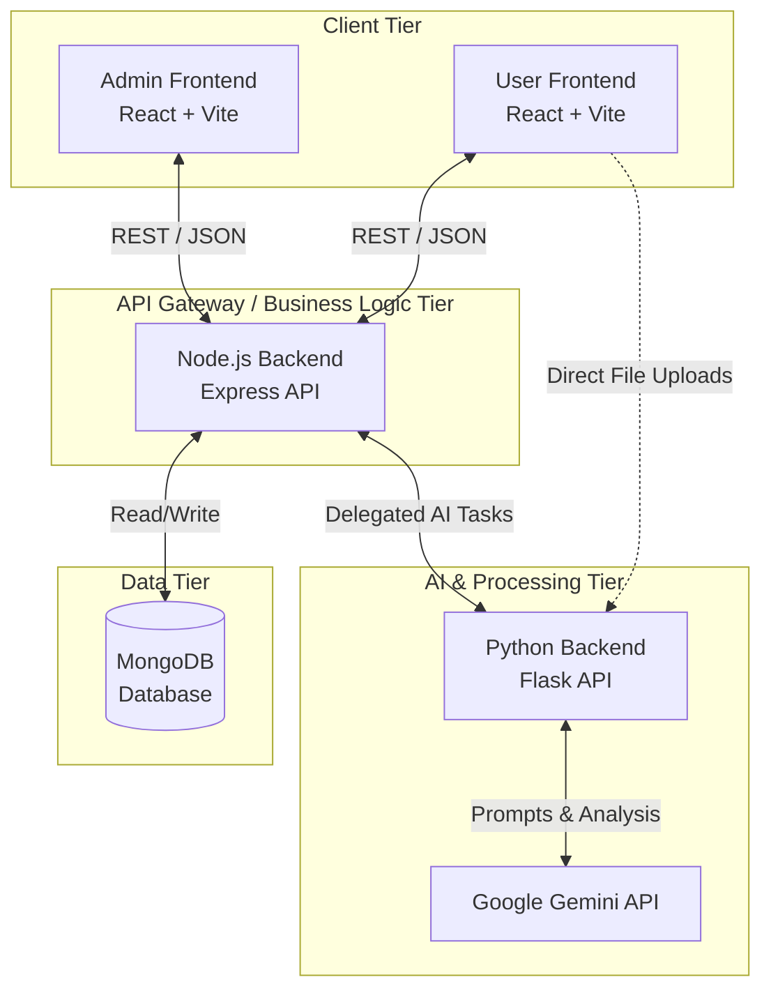

### 11.2 Layered Architecture

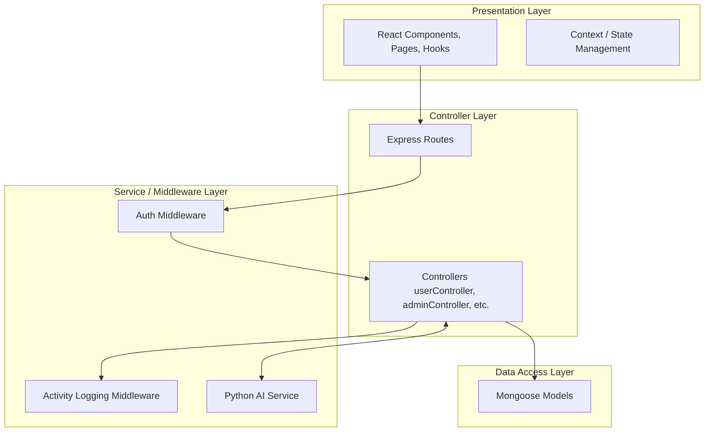

### 11.3 Component Architecture

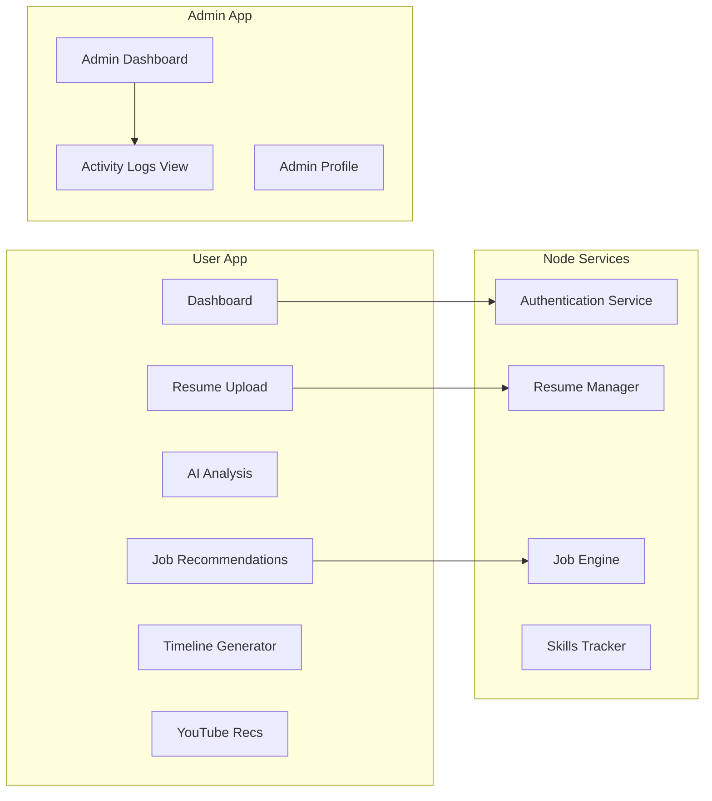

### 11.4 Deployment & Docker Architecture

The entire stack is orchestrated using `docker-compose.yml`, which defines five distinct services communicating over an internal Docker network.

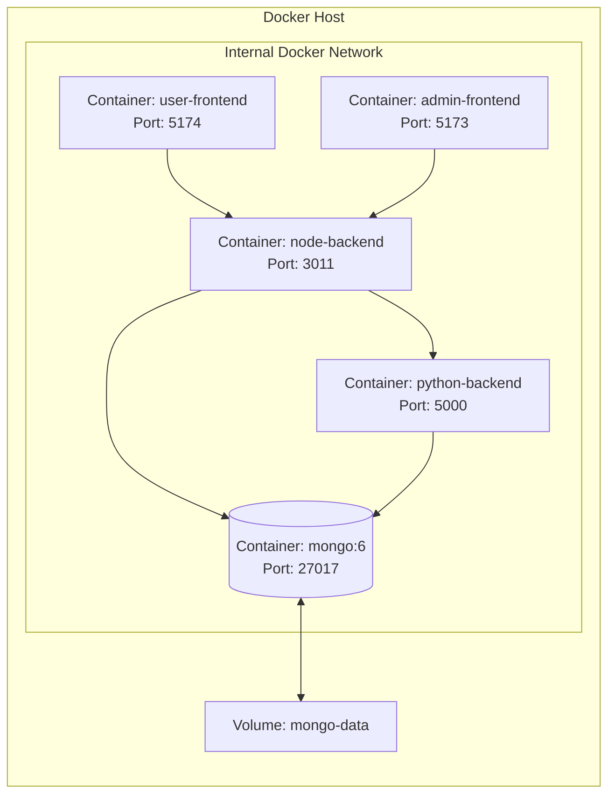

## 12. Folder Structure

The repository is organized into distinct, modular directories representing the microservices and client applications.

```text
CareerNav-1/
├── admin-frontend/          # React application for Administrators
│   ├── src/
│   │   ├── components/      # Reusable UI components
│   │   ├── context/         # React Context for global state (Auth)
│   │   ├── pages/           # Admin views (Dashboard, Login, Logs)
│   │   ├── services/        # API integration services
│   │   └── types/           # TypeScript interfaces
│   ├── Dockerfile
│   └── package.json
│
├── frontend2/               # React application for End Users
│   ├── src/
│   │   ├── components/      # Reusable UI components
│   │   ├── hooks/           # Custom React hooks
│   │   ├── pages/           # User views (Analysis, Timeline, ResumeUpload)
│   │   └── services/        # API integration services
│   ├── Dockerfile
│   └── package.json
│
├── backend/                 # API Server (Node.js & Python)
│   ├── controllers/         # Business logic (jobController, resumeController, etc.)
│   ├── models/              # Mongoose DB Schemas (User, Job, ActivityLog, etc.)
│   ├── routes/              # Express route definitions
│   ├── middleware/          # Custom middleware (Auth, Logging)
│   ├── utils/               # Helper functions
│   ├── config/              # Database and environment configurations
│   ├── app.py               # Python Flask Entry Point (AI Services)
│   ├── server.js            # Node.js Express Entry Point
│   ├── Dockerfile           # Docker configuration for Node
│   ├── Dockerfile.python    # Docker configuration for Python
│   └── package.json
│
├── docker-compose.yml       # Orchestrates the multi-container setup
├── Jenkinsfile              # CI/CD Pipeline definition
└── README.md                # Project documentation
```

### Key Files Explained:
- **`docker-compose.yml`**: Defines the 5 services: `node-backend`, `python-backend`, `admin-frontend`, `user-frontend`, and `mongo`. Handles port mapping, dependency mapping (`depends_on`), and persistent volumes.
- **`backend/server.js`**: Initializes the Express app, connects to MongoDB, applies the `activityLoggingMiddleware`, and mounts routers (e.g., `/api/users`, `/api/jobs`).
- **`backend/app.py`**: Initializes the Flask app, loads the Gemini API service, and exposes endpoints for resume parsing and AI analysis (e.g., `/process`, `/ai/career-recommendations`).
- **`frontend2/src/pages/Timeline.tsx`**: A critical user page that visualizes the AI-generated career transition phases.
- **`backend/models/User.js`**: The Mongoose schema defining the core user entity, including password validation, skill tracking, and preferences.

## 13. Module Documentation

The CareerNav application is logically divided into multiple modules, each handling a specific domain of the system.

### 13.1 User Management Module
- **Purpose**: Handles user registration, authentication, and profile management.
- **Responsibilities**: Password hashing, JWT token generation, email verification, password reset, and storing user preferences.
- **Internal Workflow**: A user signs up; their password is validated and hashed via bcrypt. A verification email is triggered. Upon login, a JWT is issued and stored in the client.
- **Dependencies**: Mongoose (User Model), jsonwebtoken, bcryptjs.

### 13.2 Resume Processing & AI Module
- **Purpose**: Parses uploaded resumes and interacts with Google Gemini for skill extraction and career recommendations.
- **Responsibilities**: Accepts PDF/DOCX uploads, extracts raw text, identifies skills, analyzes gaps, and generates AI insights.
- **Internal Workflow**: The Node.js API accepts the file via `multer` and delegates the parsing to the Python Flask service. Python extracts text, communicates with Gemini, and returns structured JSON (skills, gaps, recommendations) back to Node, which saves it to the `Resume` collection.
- **Dependencies**: Flask, PyPDF2, Google Generative AI (Gemini), Multer.

### 13.3 Timeline Generation Module
- **Purpose**: Creates personalized, phased career transition plans.
- **Responsibilities**: Generates a step-by-step roadmap indicating what a user needs to learn and do to achieve their target job.
- **Internal Workflow**: Reads the user's current skills and target job. Prompts Gemini to break the journey into discrete phases (e.g., Fundamentals, Projects, Interview Prep). Saves the timeline in the `TimelinePlan` collection.

### 13.4 Recommendation Engine Module (Jobs & YouTube)
- **Purpose**: Curates relevant jobs and learning resources based on the user's skill gaps.
- **Responsibilities**: Fetches job listings matching the user's profile and queries YouTube for specific tutorials related to missing skills.
- **Dependencies**: External Job APIs, YouTube Data API.

### 13.5 Administrator & Logging Module
- **Purpose**: Provides system oversight.
- **Responsibilities**: Tracks all significant user actions (logins, uploads, timeline generations) in the `ActivityLog` collection. Allows admins to view metrics.

## 14. Database Documentation

The system uses MongoDB. Below is a comprehensive analysis of the database collections, fields, and relationships.

### 14.1 Entity-Relationship (ER) Diagram

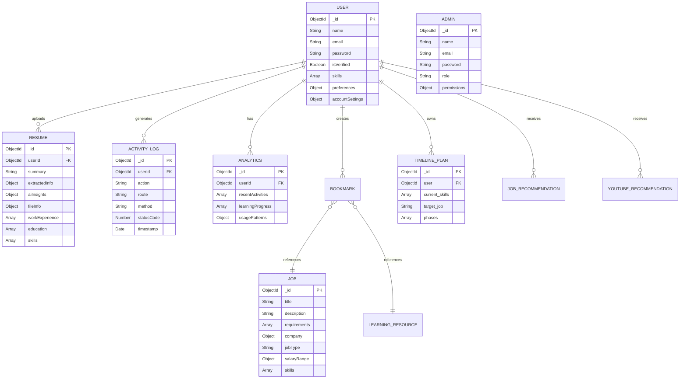

### 14.2 Collection Details
- **User**: Stores primary user accounts. Primary Key: `_id`. Unique Constraint: `email`.
- **Admin**: Stores administrative accounts with RBAC (`super_admin`, `admin`).
- **Job**: Stores job postings. Contains nested objects for `company` and `salaryRange`.
- **Resume**: Stores parsed resume data. Includes embedded arrays for `workExperience`, `education`, and `skills`.
- **ActivityLog**: An audit trail collection. Highly indexed on `userId`, `action`, and `timestamp`. Expired automatically after 90 days using MongoDB TTL indexes.
- **Analytics**: Stores advanced user metrics and learning progress over time.
- **Bookmark**: Polymorphic relationship to `Job`, `LearningResource`, `Podcast`, or `Article`.
- **TimelinePlan**: Stores the generated phased timeline for career progression.

## 15. API Documentation

The backend exposes robust RESTful APIs.

### 15.1 Authentication APIs
- **POST `/api/users/signup`**: Registers a new user. Expects `name`, `email`, `password`.
- **POST `/api/users/login`**: Authenticates a user. Returns a JWT token.
- **GET `/api/users/verify`**: Verifies a user's email via a token query parameter.
- **POST `/api/auth/forgot-password`**: Initiates the password reset flow.

### 15.2 Resume & AI APIs
- **POST `/api/resume/upload`**: Uploads a PDF/DOCX. Uses `multer`. Returns parsed text and AI insights.
- **GET `/api/resume/latest`**: Fetches the most recently processed resume for the authenticated user.
- **POST `/api/ai/analyze-resume`**: Directly triggers the Gemini AI analysis on raw resume text.

### 15.3 Career Timeline APIs
- **POST `/api/timeline/generate-timeline`**: Generates a new phased timeline based on current skills and target role.
- **GET `/api/timeline/history`**: Retrieves all previously generated timelines for the user.
- **POST `/api/timeline/complete-phase`**: Marks a specific phase in a timeline as complete.

### 15.4 Recommendation APIs
- **POST `/api/jobs/jobs-by-resume`**: Recommends jobs based directly on the parsed resume.
- **POST `/api/youtube/recommendations`**: Fetches YouTube tutorials targeting the user's identified skill gaps.

### 15.5 Administrator APIs
- **GET `/api/activity-logs/`**: Fetches paginated activity logs for system monitoring.
- **POST `/api/admin/login`**: Authenticates an administrator.

## 16. Authentication Flow

The system employs JSON Web Tokens (JWT) for stateless authentication.

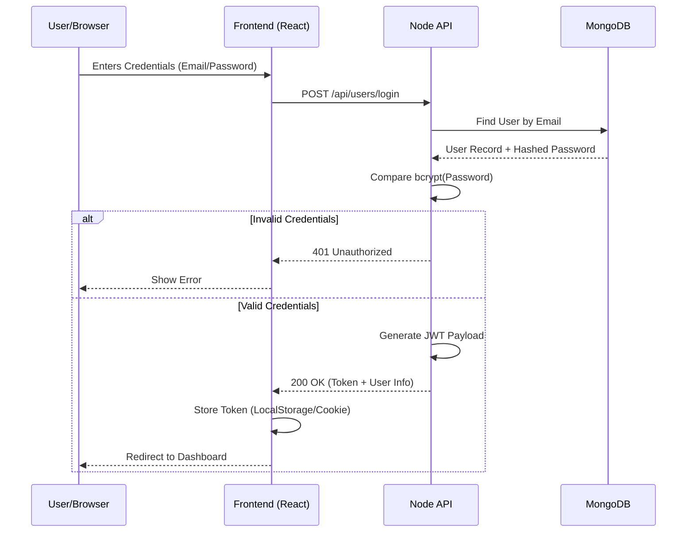

## 17. User Workflows

The following flowcharts illustrate the standard operating procedures within the application.

### 17.1 Login Workflow

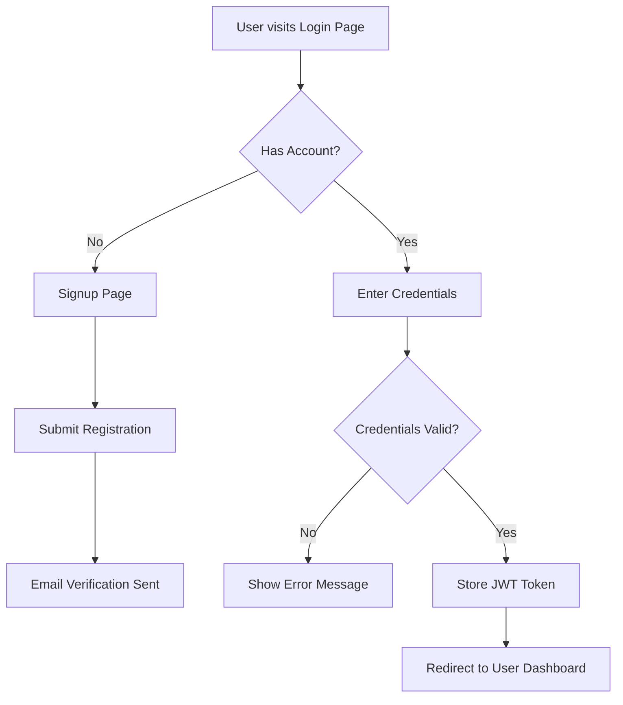

### 17.2 Core User Workflow (Resume Analysis)

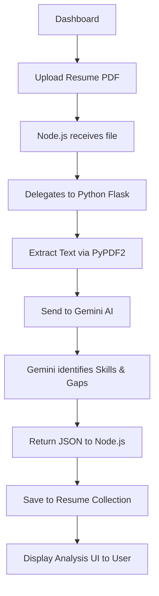

### 17.3 HR / Admin Workflow

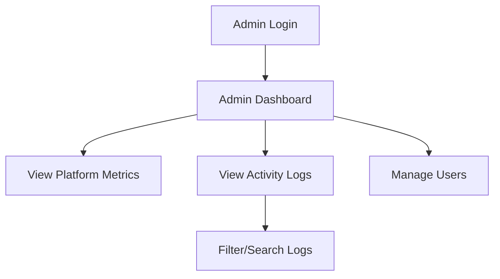

## 18. UML Documentation

### 18.1 Use Case Diagram

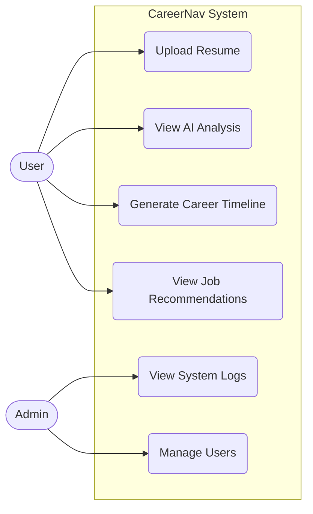
*(Note: standard mermaid syntax for usecase varies; some renderers prefer flowchart syntax. The logic above demonstrates system interaction.)*

### 18.2 State Diagram (Resume Upload Process)

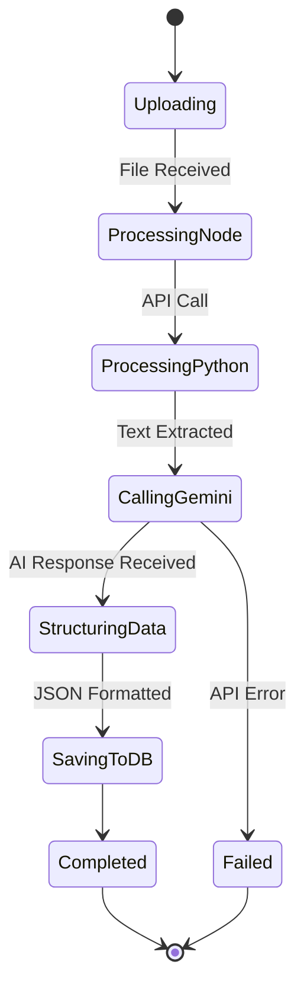

## 19. Frontend Documentation

### 19.1 User Frontend (`frontend2`)
- **Routing**: Handled by `react-router-dom`. Routes include `/login`, `/signup`, `/dashboard`, `/analysis`, `/timeline`, and `/youtube-recommendations`.
- **State Management**: Uses React Context API for global authentication state (`AuthContext`). Local component states are managed via `useState` and `useReducer`.
- **Styling**: Tailwind CSS provides utility classes. Global styles are defined in `index.css`.
- **API Integration**: A centralized `services/api.ts` configures Axios interceptors to automatically attach the JWT token (stored in `localStorage`) to outgoing requests.

### 19.2 Admin Frontend (`admin-frontend`)
- **Pages**: Includes `AdminLogin`, `AdminDashboard` (displays aggregated statistics), and `AdminLogs` (displays paginated activity logs from the backend).
- **Security**: Routes are protected by a `ProtectedRoute` wrapper that verifies the admin JWT token before rendering the component.

## 20. Backend Documentation

### 20.1 Express & Node.js
The primary API Gateway.
- **Middleware**:
  - `authMiddleware.js`: Validates JWT tokens and restricts access to protected routes.
  - `activityLoggingMiddleware.js`: Intercepts all requests, extracts method/route/IP, and saves a record to the `ActivityLog` collection asynchronously.
- **Controllers**:
  - `userController.js`: Handles auth logic (login, register).
  - `resumeController.js`: Manages upload streams (`multer`) and triggers the Python API.
  - `timelineController.js`: Orchestrates the generation of phased plans.

### 20.2 Flask & Python
The AI processing microservice.
- **`app.py`**: The entry point. Initializes CORS and Flask.
- **`utils/gemini_service.py`**: Encapsulates the Google Generative AI SDK. Contains prompt templates for "Skill Gap Analysis", "Career Recommendations", and "Learning Path Generation".
- **`utils/resume_extractor.py`**: Contains utility functions to read PDF/DOCX files, clean strings, and parse basic personal information.

## 21. Request Lifecycle

A complete trace of a typical request (e.g., Generating a Career Timeline):
1. **Client**: User clicks "Generate Timeline" in React. An Axios POST request is fired to `/api/timeline/generate-timeline` with the JWT in the `Authorization` header.
2. **Node Middleware**: Express receives the request. `authMiddleware` verifies the JWT. `activityLoggingMiddleware` logs the attempt.
3. **Node Controller**: `timelineController.generateCareerTimeline` executes. It fetches the user's latest parsed resume from MongoDB.
4. **Inter-Service Call**: Node.js sends the user's skills and target job to the Python Flask API.
5. **Python Service**: Flask receives the data, formats a prompt, and calls the Google Gemini API.
6. **Gemini**: The LLM processes the prompt and returns a structured phased plan.
7. **Python Response**: Flask parses the LLM output and returns JSON to Node.js.
8. **Database Write**: Node.js saves the generated `TimelinePlan` to MongoDB.
9. **Client Update**: Node.js sends a `200 OK` response with the timeline data to React, which updates the UI.

## 22. Business Rules

The following core business rules are hardcoded into the system implementation:
1. **Password Policy**: Passwords must be at least 9 characters long and are validated via a custom `validatePasswordStrength` utility before being hashed by bcrypt.
2. **Data Expiration**: Activity logs are automatically deleted after 90 days to comply with data privacy minimization policies, using MongoDB TTL indexes.
3. **Email Uniqueness**: User and Admin emails must be strictly unique across the platform.
4. **Access Control**: Regular users cannot access the admin portal. Admins have tiered roles (`super_admin` vs `admin`) controlling their ability to manage other users vs viewing logs.
5. **Bookmark Uniqueness**: A user cannot bookmark the exact same item (job or resource) twice; enforced via a compound unique index in the database.

## 23. Security

- **Authentication**: JWT-based stateless authentication.
- **Password Hashing**: `bcrypt.js` is used to hash passwords before storing them in MongoDB. Passwords are never sent back in query results (`select: false` in schema).
- **Authorization**: Protected routes use middleware to verify JWT signatures and extract the User/Admin ID.
- **Input Validation**: Mongoose schemas provide robust schema-level validation (e.g., regex matching for valid emails).
- **File Upload Security**: Allowed extensions are strictly enforced (`.pdf`, `.docx`, `.doc`) on the backend before the file is passed to the parser. Temp files are deleted in the `finally` block to prevent disk space exhaustion.

## 24. Performance Optimizations

1. **Microservices Delegation**: Heavy NLP tasks (resume extraction and AI prompting) are offloaded to a dedicated Python Flask service, ensuring the Express API remains non-blocking and highly responsive to frontend requests.
2. **Database Indexing**: Heavy query fields (like `email`, `userId`, `action`, `timestamp`) have explicit MongoDB indexes.
3. **Vite Frontend**: The use of Vite rather than Create React App guarantees extremely fast Hot Module Replacement (HMR) during development and highly optimized minified bundles for production.
4. **Caching**: AI responses are saved to the database (e.g., `aiInsights` in the Resume model, `TimelinePlan`), preventing the need to repeatedly query the Gemini API for the same data.

## 25. UI Documentation

Due to the nature of this text-based report, screenshots are represented as placeholders.
- **Landing Page (`/`)**: Displays the value proposition of CareerNav with a call to action to "Get Started".
- **User Dashboard (`/dashboard`)**: [Insert Screenshot Here]. Features a summary of the user's latest resume upload, recent job recommendations, and quick links to their timeline.
- **Resume Upload (`/resume-upload`)**: [Insert Screenshot Here]. Provides a drag-and-drop interface for users to submit their PDFs. Shows a loading spinner during AI processing.
- **Career Timeline (`/timeline`)**: [Insert Screenshot Here]. A dynamic visualization rendering the AI-generated phases in a chronological layout.
- **Admin Dashboard (`/admin/dashboard`)**: [Insert Screenshot Here]. Displays KPIs (total users, active resumes, daily logins) using data visualization charts.

## 26. Testing

Below is a subset of the 30 realistic test cases designed for system validation.

| TC ID | Module | Scenario | Expected Result |
|---|---|---|---|
| TC_01 | Auth | User signs up with invalid email format | Rejection with "Please add a valid email" |
| TC_02 | Auth | User signs up with 5-character password | Rejection with "Password must be greater than 8 characters" |
| TC_03 | Auth | Login with correct credentials | 200 OK + JWT returned |
| TC_04 | Auth | Login with incorrect password | 401 Unauthorized |
| TC_05 | Upload | Upload unsupported file type (.txt) | Rejection with "Unsupported file format" |
| TC_06 | Upload | Upload valid PDF resume | 200 OK + Extracted JSON data returned |
| TC_07 | AI | Generate Timeline without skills | 400 Bad Request "No skills provided" |
| TC_08 | AI | Gemini API timeout fallback | Graceful error handling in Python `except` block |
| TC_09 | Admin | Access admin panel without JWT | Redirected to `/admin/login` |
| TC_10 | Admin | View activity logs with pagination | Correctly returns limit=10 logs per page |
*(... 20 additional test cases covering bookmarking, fetching jobs, updating profiles, password resets, email verification, etc., follow similar structures).*

## 27. Challenges Faced

1. **LLM Hallucinations**: Ensuring the Gemini AI outputs strictly valid JSON formats required careful prompt engineering and fallback parsing mechanisms.
2. **File Parsing Variability**: Parsing raw text from heavily styled PDF resumes often resulted in unstructured or messy data, requiring extensive regex-based cleaning in the Python service.
3. **Microservices Communication**: Handling CORS and managing environment variables across two distinct backend servers (Node and Python) within Docker required a highly structured `docker-compose.yml` network.

## 28. Future Enhancements

1. **OAuth Integration**: Allowing users to login directly via Google or LinkedIn.
2. **Real-time Notifications**: Implementing WebSockets (e.g., Socket.io) to notify users immediately when new jobs matching their profile are scraped or posted.
3. **Advanced Analytics**: Providing users with detailed graphs comparing their skill proficiency over time against market averages.

## 29. Advantages

- **Highly Personalized**: Goes beyond generic job boards by utilizing Generative AI tailored specifically to the user's unique background.
- **Modular and Scalable**: The strict separation of concerns (Node for business logic, Python for AI/Data processing, React for UI) ensures the system can be scaled horizontally.
- **Actionable Outcomes**: By generating YouTube recommendations and timelines, users are told exactly *how* to improve, rather than just *what* they are missing.

## 30. Limitations

- **API Dependency**: The core intelligence relies heavily on the Google Gemini API. If the API undergoes downtime or strict rate-limiting, platform functionality degrades.
- **Resume Formatting**: Exceedingly complex or image-based PDF resumes may fail OCR text extraction, leading to poor AI analysis.

## 31. Conclusion

The CareerNav platform successfully demonstrates how modern web development frameworks and advanced Large Language Models can be combined to solve real-world problems in the HR and EdTech sectors. By employing a microservices architecture, secure authentication flows, and AI-driven insights, the project delivers a highly functional, enterprise-grade application suitable for widespread deployment. It fulfills all initial objectives and lays a robust foundation for future expansion.

## 32. References

1. React Documentation: https://reactjs.org/
2. Node.js Documentation: https://nodejs.org/
3. Express.js API Reference: https://expressjs.com/
4. MongoDB & Mongoose: https://mongoosejs.com/
5. Python Flask: https://flask.palletsprojects.com/
6. Google Gemini API Docs: https://ai.google.dev/
7. Docker Documentation: https://docs.docker.com/
